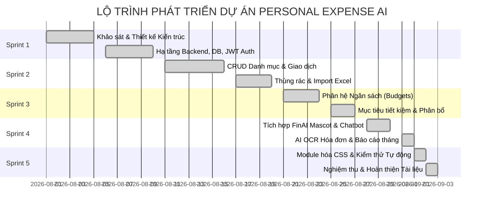

# QUY TRÌNH VÀ KẾ HOẠCH PHÁT TRIỂN PHẦN MỀM

Tài liệu ghi nhận toàn bộ quá trình lập kế hoạch, phân tích, thiết kế, triển khai và kiểm thử dự án **Personal Expense AI** theo phương pháp **Agile / Scrum**.

---

## 1. TỔNG QUAN PHƯƠNG PHÁP LUẬN (METHODOLOGY)

Dự án áp dụng mô hình **Agile / Scrum** chia thành **5 Sprint** phát triển liên tục (mỗi Sprint tập trung vào một nhóm giá trị nghiệp vụ cốt lõi), kết hợp với quy trình kiểm thử tự động (**CI & TDD/BDD**) để đảm bảo chất lượng phần mềm không bị hồi quy (*Zero Regression*).

---

## 2. CHI TIẾT CÁC GIAI ĐOẠN (SPRINT BREAKDOWN)

### 📌 SPRINT 1: Khởi Tạo Hạ Tầng, CSDL & Xác Thực JWT
* **Mục tiêu**: Thiết lập nền móng cho hệ thống, đảm bảo cơ chế bảo mật và cấu trúc dự án chuẩn mực.
* **Nội dung thực hiện**:
  * Thiết kế sơ đồ quan hệ thực thể (ERD) và viết mã khởi tạo migration SQL ([DATABASE.md](DATABASE.md)).
  * Xây dựng tầng truy cập dữ liệu với SQLAlchemy ORM và Pydantic Schemas.
  * Cài đặt module xác thực **JWT (JSON Web Token)** chuẩn `HS256`, hash mật khẩu an toàn với **Bcrypt**.
  * Viết các API: Đăng ký (`/register`), Đăng nhập (`/login`), Quên/Đổi mật khẩu (`/forgot-password`, `/reset-password`).
  * Xây dựng layout bảo mật `ProtectedRoute` trên React Frontend.
* **Kết quả nghiệm thu**: 100% người dùng chưa đăng nhập không thể truy cập vào các trang nghiệp vụ; token hết hạn tự động điều hướng về màn hình Login.

---

### 📌 SPRINT 2: Quản Lý Danh Mục, Giao Dịch & Thùng Rác (Core CRUD)
* **Mục tiêu**: Xây dựng toàn bộ tính năng quản lý giao dịch thu/chi hằng ngày.
* **Nội dung thực hiện**:
  * **Danh mục (Categories)**: CRUD danh mục, hỗ trợ 12 danh mục mặc định, tính năng Ẩn/Hiện (*Soft-hide*) để bảo vệ các giao dịch lịch sử.
  * **Giao dịch (Transactions)**: Thêm/Sửa/Xem/Phân trang, lọc theo ngày tháng, danh mục, loại thu chi.
  * **Thùng rác (Recycle Bin)**: Cơ chế Soft-delete (`is_deleted = true`), hỗ trợ Khôi phục (Restore) hoặc Xóa vĩnh viễn (Permanent Delete).
  * **Tính năng phụ trợ**: Nhân bản nhanh giao dịch (`Duplicate`), Import sao kê hàng loạt từ file Excel.
* **Kết quả nghiệm thu**: Tất cả các thao tác CRUD đều đạt tốc độ phản hồi < 100ms, có debounce tìm kiếm và xử lý trạng thái rỗng (*Empty State*).

---

### 📌 SPRINT 3: Phân Hệ Ngân Sách, Mục Tiêu Tiết Kiệm & Khóa Toàn Vẹn Số Dư
* **Mục tiêu**: Quản lý kế hoạch tài chính dài hạn và thiết lập cơ chế khóa luồng tiền chống lỗi âm ví ảo.
* **Nội dung thực hiện**:
  * **Quản lý Ngân sách (Budgets)**: Thiết lập hạn mức chi tiêu theo từng danh mục trong tháng; thanh đo tiến độ chi tiêu và hệ thống cảnh báo bội chi.
  * **Mục tiêu Tiết kiệm (Saving Goals)**: Tạo mục tiêu, nạp tiền thủ công (`MANUAL`) hoặc trích tự động từ nguồn thu nhập (`INCOME_ALLOCATION`).
  * **Cơ chế Khóa dòng (Concurrency Locking)**: Sử dụng `SELECT ... FOR UPDATE` trên bảng User để ngăn chặn Race-condition khi nhiều thao tác tài chính diễn ra cùng lúc.
  * **Bất biến số dư**: Ngăn chặn tuyệt đối việc xóa thu nhập nếu làm số dư khả dụng bị âm.
* **Kết quả nghiệm thu**: Vượt qua 100% các test case kiểm tra số dư âm và xung đột đồng thời.

---

### 📌 SPRINT 4: Tích Hợp AI Trợ Lý FinAI, OCR Hóa Đơn & Đề Xuất Ngân Sách
* **Mục tiêu**: Ứng dụng Trí tuệ nhân tạo (AI) vào việc hỗ trợ người dùng quản lý tài chính thông minh.
* **Nội dung thực hiện**:
  * **Trợ lý ảo FinAI Mascot 3D**: Nhân vật đồng xu hoạt hình tương tác 3D nổi trên màn hình, hỗ trợ tư vấn tài chính qua chatbox.
  * **AI OCR Hóa đơn**: Tự động nhận diện số tiền, ngày mua và danh mục từ hình ảnh chụp hóa đơn (hỗ trợ Google Gemini Vision API).
  * **AI Financial Report**: Phân tích hành vi tiêu dùng trong tháng, chấm điểm sức khỏe tài chính và đưa ra lời khuyên chi tiêu.
  * **AI Budget Suggestion**: Thuật toán AI tự động đề xuất phân bổ ngân sách tối ưu cho tháng tiếp theo dựa trên lịch sử chi tiêu thực tế.
* **Kết quả nghiệm thu**: Tốc độ xử lý AI mượt mà, có overlay loading fintech chống giật lag (*Zero-Lag UI*).

---

### 📌 SPRINT 5: Tối Ưu Hóa Giao Diện, Module Hóa CSS & Kiểm Thử Tự Động Toàn Diện
* **Mục tiêu**: Chuẩn hóa mã nguồn đạt chuẩn chuyên nghiệp, tối ưu hiệu năng và kiểm thử nghiệm thu.
* **Nội dung thực hiện**:
  * **Refactoring CSS**: Bóc tách file khổng lồ `index.css` (16.552 dòng) thành **28 file CSS module hóa** độc lập theo từng component/page, giữ nguyên 100% tính toàn vẹn giao diện.
  * **Tạo dữ liệu mẫu (Seed Data)**: Xây dựng script `seed_demo.py` khởi tạo tài khoản demo `demo@example.com` với 74 giao dịch trải dài 6 tháng.
  * **Kiểm thử tự động**: Viết và chạy thành công 55 bộ test unit & integration trên frontend (Vitest) và backend (Pytest).
  * **Tài liệu hóa**: Xây dựng bộ 5 file tài liệu kỹ thuật hoàn chỉnh trong `docs/`.
* **Kết quả nghiệm thu**: Toàn bộ hệ thống vượt qua tất cả bài kiểm thử, build production thành công trong 428ms.

---

## 3. QUẢN LÝ RỦI RO & GIẢI PHÁP KỸ THUẬT (RISK MANAGEMENT)

| STT | Rủi ro tiềm ẩn | Mức độ | Giải pháp kỹ thuật đã áp dụng |
|:---:|---|:---:|---|
| **1** | **Xung đột số dư (Race Condition)** khi nạp/rút tiền đồng thời | Cao | Áp dụng khóa bi quan (Pessimistic Locking `with_for_update()`) ở cấp độ hàng trong cơ sở dữ liệu. |
| **2** | **Xóa nhầm giao dịch thu nhập** dẫn đến âm ví khả dụng | Cao | Backend chặn bằng mã lỗi `400 Bad Request` thông qua hàm kiểm tra `_ensure_projected_balance()`. |
| **3** | **CSS phình to khó bảo trì** (hơn 16.000 dòng trong 1 file) | Trung bình | Chia tách thành 28 file CSS theo kiến trúc BEM/Component-level và tập hợp qua Master Hub `index.css`. |
| **4** | **Lộ lọt thông tin nhạy cảm** (Mật khẩu, JWT Secret) | Nghiêm trọng | Băm mật khẩu 1 chiều bằng Bcrypt, quản lý khóa bí mật qua `.env`, không bao giờ commit `.env` lên Git. |
| **5** | **AI phản hồi chậm / Timeout** gây đơ giao diện | Trung bình | Tích hợp cơ chế Timeout, AbortController và Fintech Overlay Loader giúp giao diện luôn mượt mà. |
