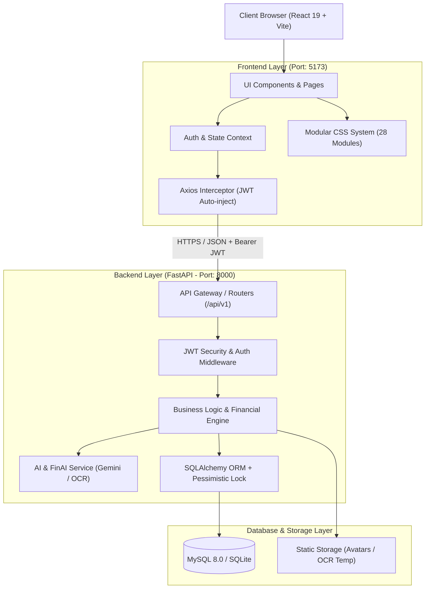
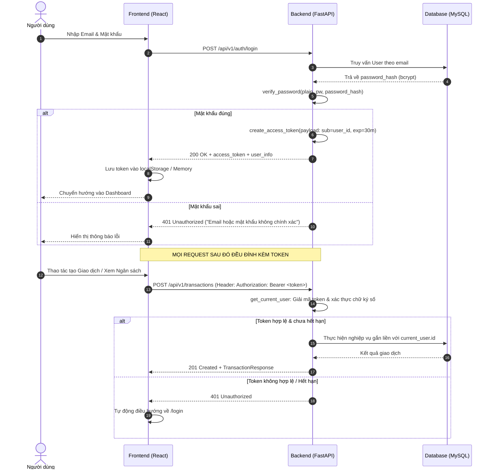
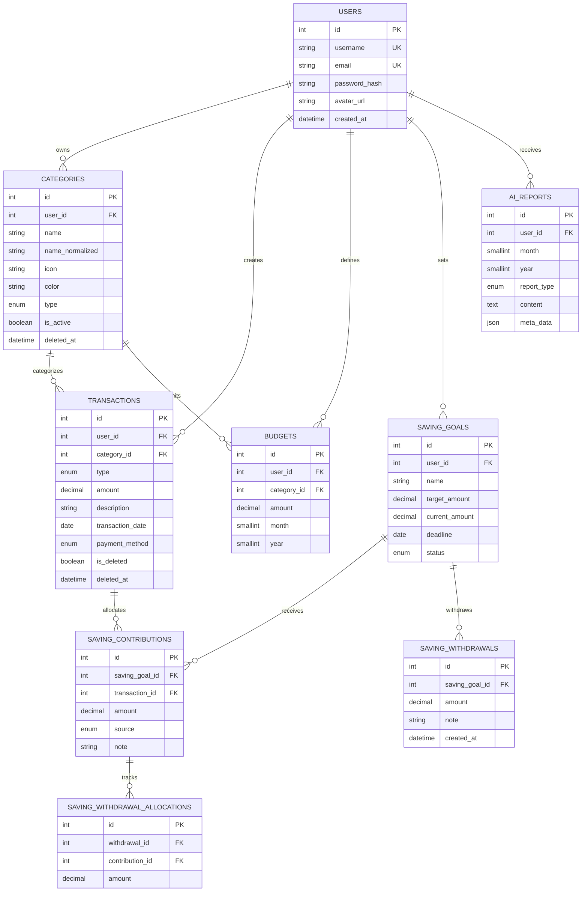

# KIẾN TRÚC HỆ THỐNG — PERSONAL EXPENSE AI

Tài liệu đặc tả kiến trúc kỹ thuật toàn diện cho hệ thống **Quản lý Chi tiêu Cá nhân Tích hợp AI (Personal Expense AI)**.

---

## 1. TỔNG QUAN KIẾN TRÚC (ARCHITECTURAL OVERVIEW)

Hệ thống được xây dựng theo mô hình **Phân tầng (Layered Architecture)** kết hợp kiến trúc hướng dịch vụ RESTful API, đảm bảo phân tách rõ ràng giữa giao diện người dùng (Frontend), tầng xử lý nghiệp vụ (Backend) và tầng lưu trữ dữ liệu (Database).



---

## 2. PHÂN BỐ CẤU TRÚC THƯ MỤC CHUẨN (5 PHÂN HỆ TIÊU CHUẨN)

Dự án được chuẩn hóa theo đúng cấu trúc tiêu chuẩn công nghiệp gồm 5 thư mục cốt lõi:

```text
personal-expense-ai/
├── 🌐 frontend/                # [FRONTEND] Giao diện người dùng React 19 + Vite
│   ├── src/
│   │   ├── api/                # Axios API client modules
│   │   ├── components/         # Reusable React components (Modals, Popups, Mascot)
│   │   ├── context/            # Global Auth & App State Context
│   │   ├── pages/              # Màn hình chức năng (Dashboard, Transactions, Budgets...)
│   │   ├── styles/             # Hệ thống 28 file CSS Module hóa (Base, Layout, Components, Pages)
│   │   ├── utils/              # Helper functions (Định dạng tiền tệ, ngày tháng)
│   │   ├── App.jsx             # React Router & Navigation shell
│   │   ├── index.css           # Master CSS Hub (@import)
│   │   └── main.jsx            # Entry point ứng dụng React
│   ├── package.json            # Quản lý dependencies frontend
│   └── vite.config.js          # Cấu hình Vite & proxy
│
├── ⚙️ backend/                 # [BACKEND] Máy chủ logic nghiệp vụ và API FastAPI
│   ├── app/
│   │   ├── api/routes/         # Các endpoint REST API (/auth, /transactions, /budgets...)
│   │   ├── core/               # Bảo mật, JWT, hashing, AI prompt logic
│   │   ├── models/             # SQLAlchemy ORM Models (User, Transaction, Category...)
│   │   ├── schemas/            # Pydantic Schemas (Request/Response validation)
│   │   ├── services/           # Nghiệp vụ xử lý phức tạp (AI OCR, Excel importer...)
│   │   ├── config.py           # Quản lý biến môi trường Pydantic Settings
│   │   ├── database.py         # Kết nối DB Engine & Session factory
│   │   └── main.py             # FastAPI Application initialization
│   ├── tests/                  # Bộ kiểm thử tự động pytest (167 test cases)
│   └── requirements.txt        # Danh sách thư viện Python
│
├── 🗄️ database/                # [DATABASE] Toàn bộ mã DDL, Migration & Seed data
│   ├── migrations/             # Các file SQL Migration (001 -> 004)
│   ├── schema.sql              # File DDL toàn vẹn của CSDL MySQL 8.0
│   ├── seed_demo.py            # Script khởi tạo 74 giao dịch demo 6 tháng
│   └── README.md               # Hướng dẫn quản trị và migration CSDL
│
├── 🔧 config/                  # [CONFIG] Quản lý cấu hình & biến môi trường
│   ├── .env.example            # Master environment configuration template
│   └── README.md               # Hướng dẫn chi tiết từng biến môi trường
│
├── 📖 docs/                    # [DOCS] Bộ tài liệu kỹ thuật toàn diện
│   ├── USER_GUIDE.md           # Hướng dẫn sử dụng chi tiết A-Z
│   ├── SYSTEM_ARCHITECTURE.md  # Tài liệu kiến trúc hệ thống (Tài liệu này)
│   ├── DEVELOPMENT_PROCESS.md  # Kế hoạch và quy trình phát triển 5 Sprint
│   ├── AI_DEVELOPMENT_LOG.md   # Nhật ký và minh chứng sử dụng AI (Prompt 5 thành phần & BA)
│   ├── API.md                  # Đặc tả chi tiết toàn bộ REST API
│   └── DATABASE.md             # Thiết kế CSDL, quy tắc khóa dòng & migration
│
└── README.md                   # Hướng dẫn tổng quan & cài đặt nhanh
```

---

## 3. CƠ CHẾ XÁC THỰC BẢO MẬT (JWT AUTHENTICATION FLOW)

Hệ thống sử dụng **JWT (JSON Web Token)** chuẩn **RFC 7519** kết hợp thuật toán ký **HMAC-SHA256 (`HS256`)** để quản lý phiên làm việc phi trạng thái (*Stateless*).

### Sơ đồ Luồng Đăng nhập & Xác thực API:



### Tại sao sử dụng JWT và rủi ro nếu không có:
1. **Khả năng mở rộng (Stateless)**: Server không phải lưu Session trong RAM/Database, giúp giảm tải tài nguyên tối đa.
2. **Ngăn chặn giả mạo**: Chữ ký `SECRET_KEY` đảm bảo người dùng không thể tự ý sửa đổi `user_id` trong token.
3. **Cô lập dữ liệu tuyệt đối (Data Isolation)**: Mọi truy vấn DB đều lọc theo `current_user.id` lấy từ token, không bao giờ tin tưởng `user_id` từ body/param phía client.

---

## 4. BẢO VỆ TOÀN VẸN LUỒNG TIỀN (FINANCIAL INTEGRITY & LOCKING)

Quản lý chi tiêu là nghiệp vụ nhạy cảm về số liệu tiền tệ. Hệ thống thiết lập **3 tầng bảo vệ bất biến (Invariants)**:

### 1. Công thức Bất biến Số dư:
$$\text{Total Balance} = \sum \text{Income} - \sum \text{Expense}$$
$$\text{Saving Balance} = \sum \text{Active Saving Goals}$$
$$\text{Available Balance} = \text{Total Balance} - \text{Saving Balance} \ge 0$$

### 2. Chống Race-condition bằng Khóa bi quan (Pessimistic Locking):
Khi thực hiện các thao tác thay đổi số dư (tạo giao dịch, xóa thu nhập, nạp/rút tiền tiết kiệm), backend kích hoạt:
```python
db.query(User).filter(User.id == current_user.id).with_for_update().first()
```
Khóa hàng này tuần tự hóa mọi giao dịch đồng thời của cùng một User, ngăn chặn triệt để hiện tượng **Double-Spending** (tiêu tiền 2 lần cùng lúc).

---

## 5. SƠ ĐỒ THỰC THỂ CƠ SỞ DỮ LIỆU (DATABASE ERD)


